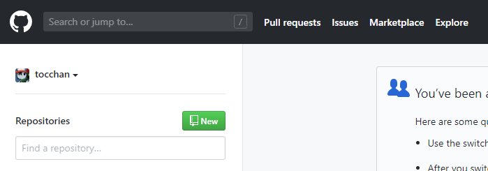
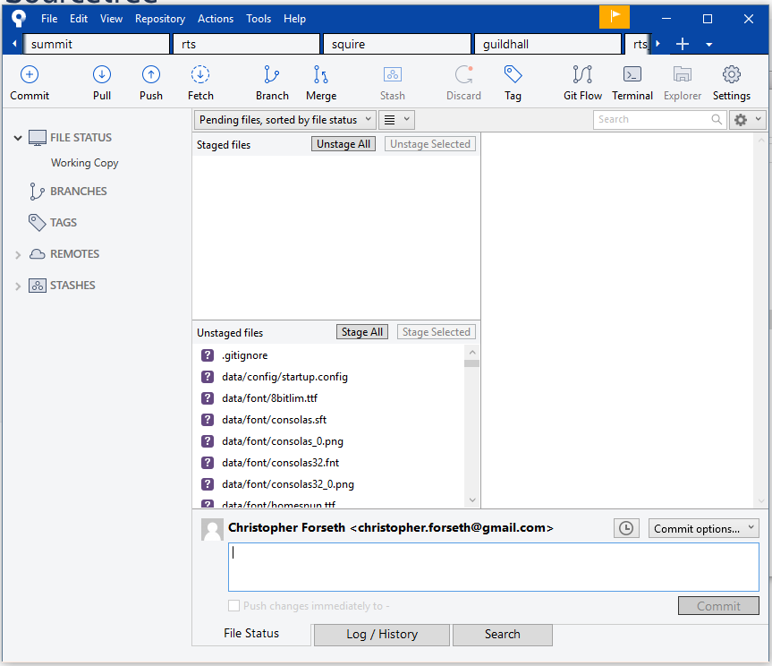
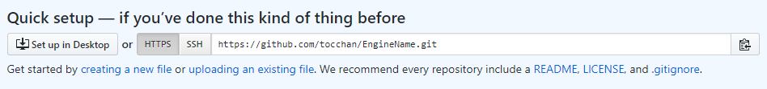
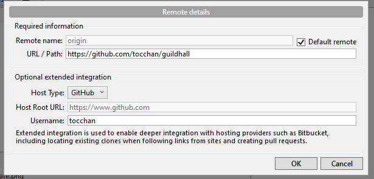
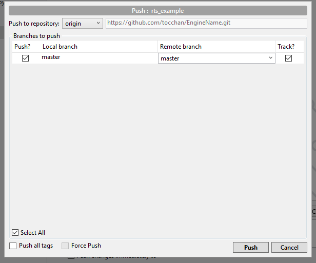
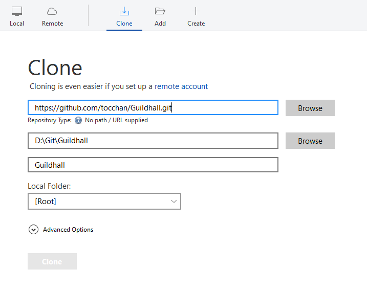

GIT Setup
======

## Overview
Basic structure is we're going to make a repot per project, and have a branch per assignment turn in. 

We're also going to have a repot for our Engine and incorporate this into our projects as a submodule, allowing different projects to point to different versions of the Engine more easily.  

This will require that we restructure our Game/Engine relationship by having our Engine be within the Game projects folder structure.  

## Resources
- [GitKraken YouTube Channel](https://www.youtube.com/channel/UCp06FAzrFalo3txskS1gCfA/videos)

## Walkthrough

### Create a GitHub account
We'll be using GitHub as it allows for private repots;  If you can not make a private repot, you may need to sign up for the [GitHub Education](https://education.github.com/pack) pack. 

### Create 2 New Repots (Engine & Guildhall)
We will leave them empty for now; 

First, go to your homepage in GitHub, and select Repositories, and click "New".

Next, create your Repot. 

### (Optional) Download Atlassian SourceTree
To make this easier - I recommend getting this GUI client for Git.  There are [numerous options](https://git-scm.com/download/gui/windows), but I personally prefer to use [SourceTree](https://www.sourcetreeapp.com/)

SourceTree tends to be more 1-1 with what Git is actually doing, and has a command console installed with it if you ever need to do something a little more esoteric. 

### Prepare your Project
Make your `Guildhall` project.  Just copy root SD folder to a new location, *not under your current P4 workspace*.

Open up SourceTree, and create a new repot, and point it at this folder.

This is setting up Git to track this folder.  Now, Git is purely a local source control, that can be mirrored on a service like github.  Currently, we just have a local repot.  Next we're going to make our initial commit, and this push it to our remote host.  Only once this is done are our changes backed up. 

### Initial Commit
After you created your project, you should be brought to a screen that looks like the following; 

The left side shows our current working branch - we'll get more into that later. 

Up top is Staged files, these are files to be commited (like a changelist in P4). 

Below that is Unstaged files.  These are all files that have been edited since the last commit, or from a currently staged file (and may need to be re-staged).  

Now, git works reactively, detecting changes (edits/adds/removes) automatically, and it will pick up a lot of files and edits we may not care about.  To sovle this, we add a `.gitignore` file to tell it what files we want it to, well, ignore. 

Download and copy this [.gitignore](gitignore_example.txt) file to your root folder, and rename it to ".gitignore".  This file helps git figure out what files do not need to be tracked.  

Go back to sourcetree, and Unstaged files should now show a `.gitignore` file near the top and you should see less files.  If you see files you don't want to track, you can right-click and select "Ignore", and either ignore just that file, that extension, or that folder.  If you need more rules, the `.gitignore` file is plain text, that applies rules top to bottom (so you can ignore all, then stop ignoring a specific file). 

Once you're happy that only the files you want tracked are in Unstaged, select "Stage All", write a commit message (bottom part of that window), and select Commit.  

### Tie it to a Remote Repot
Now, we only have this commit locally.  This has the benefit of allowing you to work offline, but it means it is not backed up until we push to remote.  

Currently, our repot isn't tied to a remote branch, so we're going to add a remote branch; 

Select Repository from the top of SourceTree, and select Repository Settings, and select add. 

Next, go to your github page, and find your repots git address;

Copy this to your clipboard, and go back to SourceTree.  Put this into the URL/Path, and select "Default Remote", ie, the origin. 

Click OK. 

You should see "origin" appear until Remotes on the left side.  Next, we're going to tie "master" to this.  So right-click on **master** (it should be bold as this is your current branch), and select "push to", and select origin. Click Push. 

This will tie the local repot to the remote repot.  Click Push.  

Go to your github page and you should see it updated.

### Test
You can now pull this remote repot to any other folder on your machine, to make a buddy build.  This should be your Engine, and it should be able to compile by itself.  

So go to SourceTree, and we're going to open a new tab and clone a repot.  All you need is your git link that you used in the above step.  

Once cloned, you should be able to navigate to that folder, and compile.  If all went well, you should still be able to compile your Engine. 

### Engine and Submodules
If you want to track your `Engine` as a submodule, we're going to repeat a number of the steps above, but just for our engine folder; 

After your `Engine` is its own Repot, we will delete it from our `Guildhall` repot and commit that change.

Next, we add `Engine` back, but this time as a submodule, which is saying this other project is part of our project, but tracked seperately.  Our project will point to a specific commit of our `Engine` after we do this.

You can add a submodule using SourceTree by selecting `Repository > Add Submodule`.  Use the git link as the URL, and give it the path of where your `Engine` should live.

If you're curious on the command line way to do this, see the following; 

https://git-scm.com/book/en/v2/Git-Tools-Submodules

### Common Pitfalls
#### Headless Branches
It can happen that your branch becomes "headless", meaning not pointing to an official branch.  If this happens, you'll notice no branch on the left side of SourceTree is in bold.

This is a great way to lose work, so if you notice this, do not change branches, as you will lose the progress you made in your headless branch.  Instead, you want to branch your headless branch into a new head to give it a name.  

Once this is done, you can merge it back into master, and then switch to master.  Master should now be bold, and you can push the changes.

#### Don't Forget to Push
All changes are local only.  So be sure, once you're about to call it a day, to push your changes to the remote branch.  Otherwise I will not be able to pull it, and more importantly, you will lose the work if something happens to your computer.   

