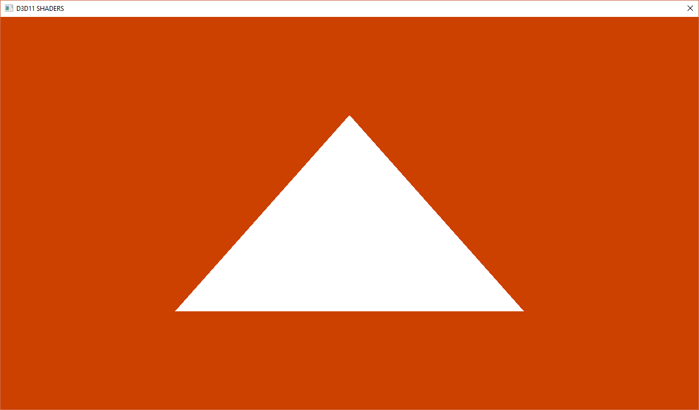

Window Creation
======

## Overview
Builds off of [d3d11/setup](https://github.com/tocchan/guildhall_samples/tree/master/d3d11/setup), and adds an examples for how a Shader is compiled from HLSL to ByteCode, and then farther compiled into a runnable Shader Program.  

## Project Property Changes;

## Notes
