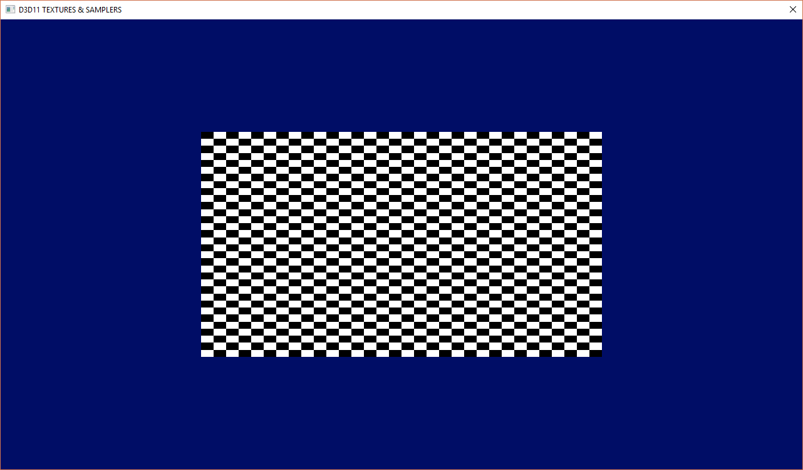

D3D11 Textures
======

## Overview
__Requires Windows 10 SDK if you want to create a Debug Context!!!__

Builds off of [d3d11/shader](../d3d11/inputbuffers) to add texturing to our toolbox of shader capability.

This example covers...
- Creating a *Texture* Object.
- Creating and using a *Shader Resource View (**SRV**)*
- Creating and using a *Sampler State*

As I do not want to include actual image loading in these examples for the sake of brevity - I programmatically create a Grid Texture for this example. 

If you want to load images, I highly recommend using [stb_image](https://github.com/nothings/stb) code.  If you need something a bit more feature rich, libjpeg and libpng are excellent options.  

## Project Property Changes;

## Notes
